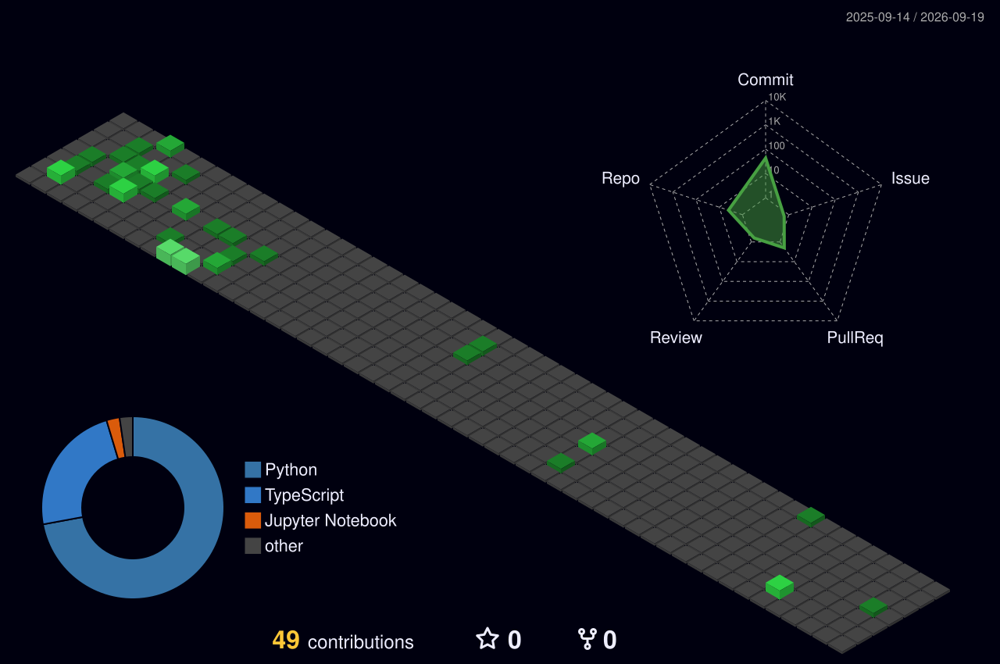

# About Me:
Olá, eu sou o Arthur!  Sou estudante de Ciência da Computação e desenvolvedor, com interesse em Cloud Computing, Engenharia de Dados e Inteligência Artificial.  Gosto de aprender novas tecnologias, desenvolver projetos e buscar soluções para problemas reais através da tecnologia.  Neste GitHub, compartilho alguns dos meus projetos, estudos e experiências ao longo da minha jornada na área de tecnologia.

## Socials:
 

# Tech Stack:
          

  

 

  
  

<h3 align="left">Connect with me:</h3>

# GitHub Stats:
 
 

## GitHub Trophies

---

<!-- Proudly created with GPRM ( https://gprm.itsvg.in ) -->
